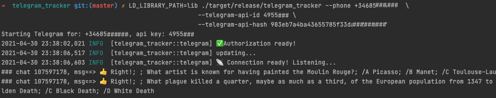

# Telegram Tracker CLI
**WARNING**: This is just an excuse to learn Rust, nothing fancy to see in this Repo!.

I didn't even complete the first 10 chapters of [The Book](https://doc.rust-lang.org/book/).

If you somehow are still interested, you will get something like this, with the Telegram tracker printing in your terminal all the incoming messages:



## Requirements

* Get your Telegram API and Hash —  which can be obtained at https://my.telegram.org.

Other than the `crate` declared at `Cargo.toml`, this crate needs `tdjson 1.6.0 dylib` in your path
for building and running your application.

* Install the dependencies: 
  `brew install gperf cmake openssl`  

* Add the libtdjson dynamic library to path (warning: it must be 1.6.0): 
  ```
  export LD_LIBRARY_PATH=$PWD/lib/
  ```

## Build 
```
LD_LIBRARY_PATH=lib cargo build --release
```

* Build with Docker
```docker build -t telegram-tracker:0.1.2 .```

## Run
```
LD_LIBRARY_PATH=lib ./target/release/telegram_tracker  \
         --phone <phone>  \
         --telegram-api-id <telegram-api-id>
         --telegram-api-hash <telegram-api-hash>
         --follow-channel-id 1312345502
```


